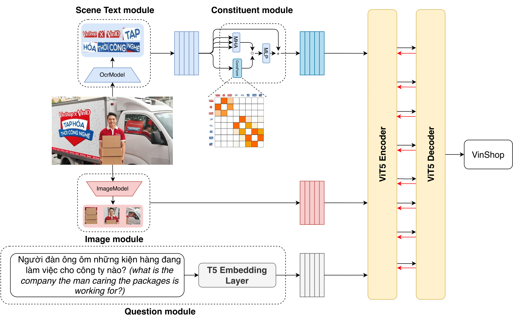
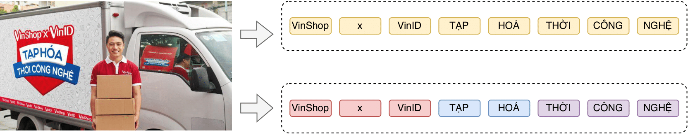

# ViConsFormer: Constituting Meaningful Phrases of Scene Texts using Transformer-based methods in Vietnamese Text-based Visual Question Answering

This is the official implementation of paper entitled <b>ViConsFormer: Constituting Meaningful Phrases of Scene Texts using Transformer-based methods in Vietnamese Text-based Visual Question Answering</b>. The experiments were conducted on the two datasets: [ViTextVQA](https://arxiv.org/abs/2404.10652) and [ViOCRVQA](https://arxiv.org/abs/2404.18397).

The main idea is to design a module that can form the meaningful constituents of Vietnamese scene text within the following two assumptions:
- The answers are exactly the scene texts available in images.
- Scene texts forwarded to the multimodal backbone must be in sorted orders.

To this end, the Constituent module which contains the Constituent Formation component and the Multi-head Attention component was proposed to form the meaningful constituents of Vietnamese scene texts.

Authors:
- [Nghia Hieu Nguyen](mailto:nghiangh@uit.edu.vn)